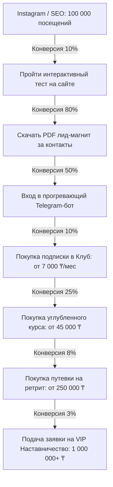

# MASTER WEBSITE BLUEPRINT: Крупнейшее женское сообщество Казахстана

Этот документ представляет собой стратегический и технический проект веб-платформы, спроектированной как высокоэффективная экосистема привлечения, вовлечения, удержания и монетизации женской аудитории в Казахстане. 

Целевые показатели платформы:
*   **Трафик**: 100 000+ уникальных посетителей в год.
*   **Лидогенерация**: 10 000+ лидов в год (конверсия в лид — 10%).
*   **Продажи**: 1 000+ платящих участниц (конверсия из лида в покупку — 10%).
*   **Финансовая цель**: Десятки миллионов тенге годовой выручки за счет многоступенчатой воронки.

---

## ЧАСТЬ 1. АРХИТЕКТУРА САЙТА И КАРТА СТРАНИЦ

Каждая страница платформы выполняет конкретную бизнес-задачу. Здесь нет «лишнего» контента — каждый раздел ведет пользователя по пути от случайного посетителя до лояльного резидента клуба.

| Страница | Основная цель | Конверсия (во что) | Главный CTA (призыв к действию) | Ключевой KPI |
| :--- | :--- | :--- | :--- | :--- |
| **1. Главная** | Позиционирование, сегментация и вовлечение | Переход на Тесты или Клуб | «Найти свое направление» / «Пройти тест» | % отказов, глубина просмотра |
| **2. Тесты** | Сбор контактов (лидогенерация) через геймификацию | Подписка на лид-магнит (Email/TG) | «Узнать результаты теста» | Конверсия в лид (целевой >15%) |
| **3. Лид-магниты** | Выдача пользы и прогрев | Вход в автоворонку Telegram-бота | «Скачать руководство (PDF)» | Количество скачиваний, переход в бот |
| **4. Блог** | SEO-привлечение холодного трафика | Переход на тесты или лид-магниты | «Пройти тест по теме статьи» | Органический трафик из Google |
| **5. Истории успеха** | Социальное доказательство и снятие барьеров | Переход на страницу Клуба | «Хочу такую же трансформацию» | Время на странице, клики по CTA |
| **6. Клуб** | Продажа регулярной подписки (рекуррентные платежи) | Оплата членства в клубе | «Вступить в сообщество (₸/мес)» | Конверсия в покупку, LTV, отток (Churn) |
| **7. Курсы** | Продажа глубоких образовательных программ | Покупка образовательного курса | «Выбрать тариф обучения» | Средний чек (AOV), конверсия |
| **8. Ретриты** | Продажа премиальных офлайн-выездов | Заявка на участие (High-ticket) | «Забронировать место на ретрит» | Количество заявок, стоимость лида (CPL) |
| **9. Наставничество**| Продажа персональной VIP-работы | Заявка на собеседование-отбор | «Подать заявку на наставничество» | Конверсия в квалифицированную заявку |
| **10. Подкаст** | Бренд-маркетинг, эмоциональный прогрев | Подписка на медиа-каналы и бот | «Слушать выпуск в Telegram» | Количество прослушиваний, дослушиваемость |
| **11. FAQ** | Снятие возражений по оплате и форматам | Переход к покупке | «Остались вопросы? Написать в WhatsApp» | Снижение нагрузки на техподдержку |
| **12. Контакты** | Доверие, юридическая прозрачность | Обращение в поддержку | «Связаться с нами» | Количество входящих обращений |

---

## ЧАСТЬ 2. ГЛАВНАЯ СТРАНИЦА: СТРУКТУРА И WIREFRAME

Главная страница спроектирована как мульти-сегментированный хаб. Основная задача — мгновенно распределить женщин по их текущим болям (сегментам) и предложить им релевантное решение.

### Wireframe первого экрана (Hero Section)

```
+---------------------------------------------------------------------------------------+
|  [Logo: UMAY]                   Каталог  Блог  Клуб  Подкаст  FAQ         [Вступить в Клуб]   |
+---------------------------------------------------------------------------------------+
|                                                                                       |
|    Казахстанское сообщество женщин, которые выбирают себя                             |
|                                                                                       |
|    <h1>ОТЛИЧНАЯ КЕЛІН, УСПЕШНЫЙ ЛИДЕР ИЛИ СВОБОДНАЯ ЖЕНЩИНА?</h1>                    |
|    <h3>Найдите баланс между традициями, карьерой и личным счастьем без чувства вины.</h3>|
|                                                                                       |
|    [ Пройти тест на баланс сфер жизни ]      [ Узнать больше о клубе ]                |
|                                                                                       |
|    * Доверительный тест прошли уже 42,000+ женщин Казахстана                          |
|                                                                                       |
|    +-----------------------------+  +------------------------+  +----------------+    |
|    | Ассоциация психологов РК    |  | 98% участниц отмечают  |  | Упоминания в:  |    |
|    | Сертифицированные методики  |  | снижение тревожности   |  | Forbes, Forbes |    |
|    +-----------------------------+  +------------------------+  +----------------+    |
|                                                                                       |
+---------------------------------------------------------------------------------------+
```

### Полная структура главной страницы (сверху вниз)

1.  **Header (Шапка)**: Логотип, меню, переключатель языка (KZ/RU), кнопка «Вступить в Клуб» (выделена акцентным цветом).
2.  **Hero Screen (Первый экран)**: Сильный заголовок, ориентированный на внутренний конфликт современной казахстанской женщины (традиции vs самореализация). Два CTA (на тест и на клуб). Социальные доказательства.
3.  **Сегментационный блок «Где вы сейчас?»**: 4 интерактивные карточки:
    *   *«Я молодая келін и чувствую давление семьи»*
    *   *«Я строю карьеру, но выгораю и теряю женственность»*
    *   *«Я воспитываю детей и потеряла связь с собой»*
    *   *«Я прохожу через развод и мне нужна опора»*
    Каждая карточка ведет на специализированную посадочную страницу с тестом.
4.  **Блок презентации Клуба**: Визуализация «безопасного пространства». Видео-экскурсия по закрытой платформе, расписание встреч на месяц.
5.  **Блок экспертности (Лица проекта)**: Известные женщины Казахстана (психотерапевты, бизнес-вумен, юристы, гинекологи, коучи), входящие в экспертный совет сообщества.
6.  **Блок историй «До / После»**: Реальные кейсы трансформации (истории женщин из Алматы, Астаны, Шымкента и регионов). Фокус на изменениях в жизни, отношениях и доходах.
7.  **Интерактивный калькулятор выгорания / баланса**: Простой интерактивный виджет прямо на главной странице.
8.  **Блок бесплатных материалов**: Горизонтальный скролл с гайдами, чек-листами и мини-курсами.
9.  **Footer (Подвал)**: Полные реквизиты ТОО, ссылки на публичную оферту (очень важно для онлайн-платежей в Казахстане), ссылки на социальные сети, контакты поддержки в WhatsApp.

---

## ЧАСТЬ 3. СИСТЕМА ТЕСТОВ (ИНСТРУМЕНТ ЛИДОГЕНЕРАЦИИ)

Тесты — это главный инструмент вовлечения. Вместо агрессивных продаж мы предлагаем женщине узнать больше о себе. На выходе она оставляет контакт для получения расшифровки.

### Архитектура тестов

#### 1. «Какая ты келін?» (Юмористическо-психологический тест)
*   **Цель**: Виральность, шеринг в соцсетях, вовлечение молодой аудитории.
*   **Вопросы (примеры)**:
    *   *Как вы реагируете на неожиданный приезд родителей мужа в воскресенье утром?* (А: Встречаю в шелковом халате и с баурсаками. Б: Сплю дальше, муж откроет. В: Начинаю паниковать из-за немытой посуды).
    *   *Кто в вашей семье принимает ключевые финансовые решения?*
*   **Результаты**: 
    *   *«Супер-келін»* (живет ради одобрения других, риск выгорания 90%).
    *   *«Ерке келін»* (свободная, но частые конфликты с родственниками).
    *   *«Осознанная келін»* (балансирует границы и уважение к традициям).
*   **Лид-магнит**: PDF-руководство «Как выстроить личные границы с родственниками мужа и остаться любимой келін».
*   **Путь пользователя**: Перенаправление в Telegram-бот → 3-дневный мини-курс аудиосообщений от семейного психолога → Приглашение на вебинар Клуба.

#### 2. Тест на уровень эмоционального выгорания
*   **Цель**: Выявление острой боли, предложение профессиональной психологической помощи.
*   **Вопросы**: Оценка физической усталости, апатии, раздражительности по шкале от 1 до 5.
*   **Результаты**: Зеленая зона (норма), Желтая зона (риск), Красная зона (истощение).
*   **Лид-магнит**: Чек-лист «Практика заземления: как вернуть ресурс за 10 минут в день».
*   **Путь пользователя**: Бот предлагает тест → Выдача результатов → Видео-разбор от клинического психолога сообщества → Оффер на покупку курса «Антистресс» или терапевтическую сессию в Клубе.

#### 3. Уровень уверенности и самооценки
*   **Цель**: Выявление синдрома самозванца, страха проявляться.
*   **Результаты**: Зависимая самооценка / Нестабильная / Здоровая.
*   **Лид-магнит**: Audio-медитация «Возвращение внутренней силы».
*   **Путь пользователя**: Подписка в боте → Получение аудио-медитации → Серия писем с разбором психологических зажимов → Предложение вступить в Клуб для проработки самооценки.

#### 4. Баланс семьи и себя
*   **Цель**: Для замужних женщин и мам, разрывающихся между карьерой и домом.
*   **Результаты**: Индивидуальное колесо баланса, построенное на лету.
*   **Лид-магнит**: Планер «Осознанная мама: как делегировать быт без чувства вины».
*   **Путь пользователя**: Отправка колеса баланса на почту/в мессенджер → Разбор каждой сферы в боте → Приглашение на мастер-майнд Клуба.

#### 5. Готовность к изменениям (карьера, развод, переезд)
*   **Цель**: Для женщин в кризисных точках жизни.
*   **Результаты**: Индекс адаптивности (AQ).
*   **Лид-магнит**: PDF «Гид по безопасной перезагрузке карьеры и жизни».
*   **Путь пользователя**: Предложение личной консультации с куратором сообщества → Оффер на наставничество или ретрит.

---

## ЧАСТЬ 4. SEO-КОНТЕНТ-МАШИНА

Органический трафик из Google — самый дешевый способ получать 100 000+ посетителей в год. Мы строим контент-машину на основе **кластерной SEO-архитектуры** (Pillar-Cluster Model).

### Структура контент-кластеров на 500 статей

Мы создаем 4 главных тематических хаба (Pillar Pages), вокруг которых группируются низко- и среднечастотные статьи (Sub-topics).

```
                              [ БЛОГ UMAY ]
                                    |
       +--------------------+-------+-------+-------------------+
       |                    |               |                   |
[ Хаб: КЕЛИН ]     [ Хаб: МОЛОДЫЕ ЖЕНЫ ] [ Хаб: МАМЫ KZ ] [ Хаб: НОВАЯ ЖИЗНЬ ]
       |                    |               |                   |
 125 статей по        125 статей по    125 статей по       125 статей по
 традициям, границам, психологии брака, послеродовой депрессии, разводу, алиментам,
 быту и адаптации     карьере и сексу   и воспитанию        карьерному росту
```

### Семантическое ядро по сегментам (Примеры тем)

#### Сегмент 1: Келін (Адаптация, традиции, границы)
*   *Pillar Page*: Полное руководство для молодой келін: как сохранить себя в новой семье.
*   *Подтемы (Sub-topics)*:
    *   «Как сказать свекрови "нет" и не прослыть невоспитанной (уятсыз)?»
    *   «Обязанности келін: традиции Казахстана глазами современного психолога.»
    *   «Синдром "хорошей девочки" в традиционной казахской семье.»
    *   «Психология чаепития: как справляться с постоянным приемом гостей без усталости.»

#### Сегмент 2: Молодые жёны (Отношения, карьера, самореализация)
*   *Pillar Page*: Как построить партнерские отношения в браке: баланс карьеры и семьи.
*   *Подтемы (Sub-topics)*:
    *   «Финансовый договор в молодой семье: как обсуждать бюджет в РК.»
    *   «Что делать, если муж против вашего карьерного роста?»
    *   «Сохранение сексуального влечения после первых лет брака.»
    *   «Как перестать контролировать мужа: советы коуча.»

#### Сегмент 3: Молодые мамы (Материнство, ресурс, депрессия)
*   *Pillar Page*: Энциклопедия ментального здоровья молодой мамы.
*   *Подтемы (Sub-topics)*:
    *   «Как распознать послеродовую депрессию: чек-лист самодиагностики.»
    *   «Как просить мужа о помощи с ребенком без скандалов.»
    *   «Декрет — не отпуск: как маме найти 1 час времени на себя в Казахстане.»
    *   «Развитие ребенка без фанатизма: как не сойти с ума от родительских чатов.»

#### Сегмент 4: Жизнь после развода (Юридическая и психологическая опора)
*   *Pillar Page*: Пошаговый план психологического и финансового восстановления после развода.
*   *Подтемы (Sub-topics)*:
    *   «Как подать на алименты в Казахстане в 2026 году (пошаговая инструкция).»
    *   «Как рассказать детям о разводе: советы детского психолога.»
    *   «Раздел имущества в РК: права женщины и частые юридические ошибки.»
    *   «Как преодолеть страх одиночества и осуждения общества после развода.»

---

## ЧАСТЬ 5. ВОРОНКА ПРОДАЖ И КОНВЕРСИОННЫЕ ПОКАЗАТЕЛИ

Воронка спроектирована по принципу «Value First» (Сначала ценность). Мы не продаем дорогие продукты сразу. Каждый шаг логически подталкивает к следующему.



### Детализация воронки на цифрах (Годовой цикл)

1.  **Трафик (Top of Funnel)**: **100 000** уникальных посетителей.
    *   *Источники*: 60% SEO блога, 30% таргет/органика Instagram/TikTok, 10% рекомендации.
2.  **Лидогенерация (MofU)**: **10 000** женщин проходят тесты и получают PDF.
    *   *Действие*: Оставляют имя, телефон (для WhatsApp) и переходят в Telegram-бот.
3.  **Вовлечение в боте**: **5 000** активных подписчиц в Telegram-боте.
    *   *Прогрев*: Получают 5-дневный цепочечный контент, приглашения на бесплатные эфиры с экспертами сообщества.
4.  **Низкий чек (Tripwire / Клуб)**: **1 000** резидентов закрытого клуба.
    *   *Чек*: 7 000 ₸ в месяц (или 70 000 ₸ в год).
    *   *Годовая выручка*: 1 000 * 70 000 ₸ = **70 000 000 ₸**.
5.  **Средний чек (Core Product / Курсы)**: **250** покупателей флагманских курсов.
    *   *Чек*: 45 000 ₸.
    *   *Годовая выручка*: 250 * 45 000 ₸ = **11 250 000 ₸**.
6.  **Высокий чек (Profit Maximizer / Ретриты)**: **30** участниц выездных ретритов в живописных местах РК (Боровое, Алматинские горы) или за рубежом.
    *   *Чек*: 350 000 ₸.
    *   *Годовая выручка*: 30 * 350 000 ₸ = **10 500 000 ₸**.
7.  **VIP-сегмент (Наставничество)**: **5** VIP-клиентов.
    *   *Чек*: 1 200 000 ₸ за 3 месяца персональной работы по перезагрузке жизни/карьеры.
    *   *Годовая выручка*: 5 * 1 200 000 ₸ = **6 000 000 ₸**.

**ИТОГО прогнозируемая годовая выручка платформы**: **97 750 000 ₸**.

---

## ЧАСТЬ 6. МОБИЛЬНАЯ ВЕРСИЯ (MOBILE-FIRST UX)

В Казахстане более 90% женщин будут заходить на сайт со смартфонов, часто используя мобильный интернет (4G / 5G). Платформа должна загружаться менее чем за 1.5 секунды и управляться одной рукой.

### Ключевые паттерны мобильного UX

*   **Sticky Bottom Navigation Bar (Липкое нижнее меню)**:
    Всегда на экране внизу находится панель быстрого доступа для большого пальца:
    `[Главная]  [Пройти Тест]  [Блог]  [Войти в Клуб (Акцентная кнопка)]`
*   **Управление одной рукой (Thumb Zone)**:
    Все важные интерактивные кнопки (добавить в корзину, начать тест, написать куратору) имеют высоту минимум 48px и располагаются по центру экрана в зоне досягаемости большого пальца.
*   **Оптимизация скорости**:
    *   Использование легких картинок WebP.
    *   Интерактивные тесты загружаются асинхронно, не блокируя рендеринг страницы.
    *   Минимум тяжелых JS-библиотек.
*   **Мобильный Личный Кабинет Клуба**:
    Адаптирован под формат PWA (Progressive Web App), чтобы женщина могла добавить иконку сообщества на экран смартфона и пользоваться им как приложением без необходимости скачивать его из App Store / Google Play.

---

## ЧАСТЬ 7. ДОВЕРИЕ И СНЯТИЕ БАРЬЕРОВ В КАЗАХСТАНЕ

Казахстанский менталитет имеет свои культурные особенности. Женщина в Казахстане часто сталкивается с понятием «Уят» (общественное осуждение) и испытывает страх открыто говорить о личных проблемах (проблемы в семье, развод, послеродовая депрессия, насилие).

### Инструменты построения доверия на сайте

1.  **Анонимность и безопасность данных**:
    *   На странице тестов четко пишем: *«Ваши ответы строго конфиденциальны. Мы не передаем данные третьим лицам. Результаты тестов придут в ваш личный бот, никто посторонний их не увидит»*.
    *   Наличие SSL-сертификата и шифрования данных.
2.  **Реальные лица экспертов с репутацией**:
    *   Интеграция профилей известных в Казахстане лицензированных психологов, юристов по семейному праву и врачей. Ссылки на их дипломы, лицензии и профессиональные ассоциации.
3.  **Истории трансформации вместо сухих отзывов**:
    *   Отказ от фальшивых отзывов со стоковыми фото.
    *   Публикация подробных историй трансформации в формате лонгридов с реальными фото (и, при желании участниц, с измененными именами для конфиденциальности).
4.  **Казахский язык (Ана тілі)**:
    *   Сайт должен иметь безупречную локализацию на казахский язык (не автоперевод, а качественный копирайтинг с учетом ментальных особенностей общения).

---

## ЧАСТЬ 8. МОНЕТИЗАЦИЯ БЕЗ АГРЕССИВНОГО ДАВЛЕНИЯ

Сообщество — это деликатная тема. Агрессивные продажи («Купи прямо сейчас или потеряешь скидку!») разрушают атмосферу доверия и безопасности. Мы используем модель **мягких нативных конверсий**.

### Модель нативных продаж

*   **Клуб (Подписка)**:
    *   *Как продаем*: Через бесплатные открытые вебинары, гостевые эфиры экспертов Клуба и публикацию саммари закрытых лекций в блоге.
    *   *Призыв*: «Попробуйте 7 дней участия всего за 1 000 ₸. Если вам не понравится, вы можете отменить подписку в один клик в личном кабинете».
*   **Курсы**:
    *   *Как продаем*: Только тем, кто прошел соответствующий тест и выявил свою проблему (например, женщина с высоким уровнем выгорания получает цепочку статей про ресурс и в конце приглашение на курс).
*   **Ретриты и VIP**:
    *   *Как продаем*: Через личный отбор и анкетирование. На странице ретритов нет кнопки «Купить», есть кнопка «Подать заявку на интервью с организатором». Это создает ощущение элитарности и гарантирует экологичное окружение на выезде.

---

## ЧАСТЬ 9. ОПТИМАЛЬНЫЙ ТЕХНОЛОГИЧЕСКИЙ СТЭК ДЛЯ КАЗАХСТАНА

Для стабильной работы сайта при посещаемости 100 000+ человек в год нужен быстрый, масштабируемый и легко администрируемый стэк технологий.

### Рекомендуемый стек

```
+-----------------------------------------------------------------------+
|                         ФРОНТЕНД И CMS                                |
|   WordPress (с конструктором Bricks или Elementor Pro)                |
|   - Обеспечивает гибкость, идеальное SEO и дешевизну поддержки        |
+------------------------------------+----------------------------------+
                                     |
                                     v
+------------------------------------+----------------------------------+
|                    ПЛАТЕЖНЫЕ ИНТЕГРАЦИИ (РК)                          |
|   1. Kaspi Pay (Интеграция Kaspi QR для физических лиц)               |
|   2. Paybox.money (Freedom Pay) - для рекуррентных платежей клуба     |
+------------------------------------+----------------------------------+
                                     |
                                     v
+------------------------------------+----------------------------------+
|                    МАРКЕТИНГ И АВТОМАТИЗАЦИЯ                          |
|   * CRM: Kommo (amoCRM) - для работы с лидами                         |
|   * Рассылки: ActiveCampaign / Unisender                              |
|   * Мессенджеры: Mobizon (СМС-уведомления по Казахстану)              |
|   * Чат-боты: SaleBot / LeadTeh (для Telegram & WhatsApp)             |
+-----------------------------------------------------------------------+
```

1.  **CMS (Платформа)**: **WordPress**. 
    *   *Почему*: Отличный SEO-движок из коробки (критично для нашего блога на 500 статей). Огромное количество готовых плагинов интеграции с платежными шлюзами СНГ. Легко найти разработчиков в Казахстане для поддержки.
2.  **Платежный шлюз (Эквайринг)**: **Paybox.money (Freedom Pay)** или **Jusan Pay**.
    *   *Критично для клуба*: Нам нужна функция **рекуррентных платежей** (автоматическое списание подписки каждый месяц). Freedom Pay предоставляет надежный API для Казахстана с поддержкой тенге (₸).
    *   *Для быстрых продаж*: Вывод **Kaspi QR** (кнопка ведет на оплату в приложении Kaspi) — повышает конверсию в Казахстане на 40-50%.
3.  **CRM-система**: **Kommo (бывшая amoCRM)**.
    *   *Почему*: Идеальная интеграция с WhatsApp и Telegram. Менеджер поддержки видит всю переписку с клиенткой в одном окне, может выставить счет прямо в чат.
4.  **Локальные СМС-шлюзы**: **Mobizon.kz** или **SMS.ru (Казахстан)**.
    *   *Назначение*: Отправка авторизационных СМС при входе в личный кабинет, напоминания о начале вебинаров.

---

## ЗАКЛЮЧЕНИЕ: СИСТЕМА РОСТА БИЗНЕСА (GROWTH ENGINE)

Сайт сообщества UMAY — это не просто набор веб-страниц, а **автоматизированный конвейер**, превращающий холодный интерес в долгосрочную лояльность:

```
  [Холодный трафик из Google] 
            │
            ▼ (Читает статью о границах свекрови)
     [Проходит тест]
            │
            ▼ (Оставляет телефон для получения PDF)
  [Автоворонка в WhatsApp/TG]
            │
            ▼ (Покупает тест-драйв Клуба за 1 000 ₸)
  [Резидент закрытого Клуба] ───► [Покупка Курсов, Ретритов, VIP] ───► [LTV & Сарафанное радио]
```

Данная архитектура гарантирует стабильную окупаемость трафика и создает сильный, безопасный и любящий бренд, помогающий тысячам казахстанских женщин находить свой истинный путь.
